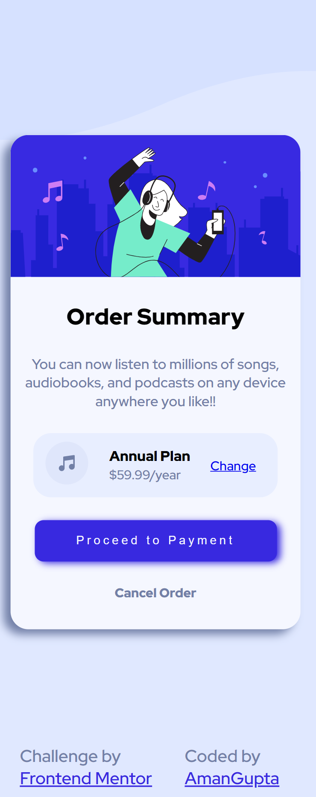

# Order-Summary-Component
# Frontend Mentor - Order summary card solution

This is a solution to the [Order summary card challenge on Frontend Mentor](https://www.frontendmentor.io/challenges/order-summary-component-QlPmajDUj). Frontend Mentor challenges help you improve your coding skills by building realistic projects.

## Table of contents

- [The challenge](#the-challenge)
- [Screenshot](#screenshot)
- [Links](#links)
- [My process](#my-process)
  - [Built with](#built-with)
  - [What I learned](#what-i-learned)
  - [Continued development](#continued-development)
  - [Useful resources](#useful-resources)
- [Author](#author)
- [Acknowledgments](#acknowledgments)

### The challenge

Users should be able to:

- See hover states for interactive elements

### Screenshot




### Links

- Solution URL: [Add solution URL here](https://your-solution-url.com)
- Live Site URL: [Add live site URL here](https://your-live-site-url.com)

### Built with

- CSS custom properties
- Flexbox

### What I learned

```html
<div class="summary-item">
  <div class="summary-banner">
    
  </div>

  <div class="summary-text-content">
    <h1 class="big-heading fw-800">Order Summary</h1>
    <p class="summary-text fw-500 ">
      You can now listen to millions of songs, audiobooks, and podcasts on any
      device anywhere you like!!
    </p>

    <div class="summary-plan">
      <div class="plan-banner">
        
      </div>

      <div class="plan-description">
        <h3 class="fw-800">Annual Plan</h3>
        <span>$59.99/year</span>
      </div>

      <div class="change-plan">
        <p><a href="/">Change</a></p>
      </div>
    </div>

    <div class="btn-group">
      <button class="proceed-btn">Proceed to Payment</button>
      <p class="cancel-order fw-800">Cancel Order</p>
    </div>
  </div>
</div>
```

```css
.container::before {
  content: "";
  background: url("/images/pattern-background-desktop.svg") center
    center/contain;
  position: absolute;
  width: 100%;
  height: 26rem;
  top: 0;
  left: 0;
  z-index: -1;
}
```

### Continued development
1) Pseudo-classes
2) Position

### Useful resources

- [MDN-CSS-Pseudo-Classes](https://developer.mozilla.org/en-US/docs/Web/CSS/Pseudo-classes)
- [W3School -> z-index](https://www.w3schools.com/css/css_z-index.asp)

## Author

- Website - [Add your name here](https://www.your-site.com)
- Frontend Mentor - [@AmanGupta1703](https://www.frontendmentor.io/profile/AmanGupta1703)

## Acknowledgments
- [Net Ninja](https://www.youtube.com/c/TheNetNinja)
